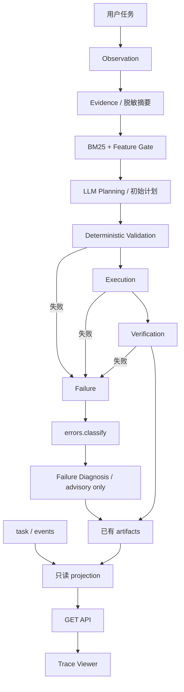

# Web Data Agent

一个本地 AI Web Agent 工程演示，从证据采集、RAG 检索、LLM 初始规划，到确定性执行验证，并通过 Trace Viewer 查看全过程证据。

采集、检索、存储和界面运行在本机，初始规划使用 DeepSeek 云端 API。当前仅支持受控的字面量 loopback 目标，不是通用公网爬虫，也不是完全离线系统。

当前里程碑：**M5.4 Final Freeze**。M5.4-A（Trace Projection Foundation）与 M5.4-B（Read-only Trace Viewer）已提交；M5.4-C（Showcase Polish）文档待验收，尚未完成本轮冻结或创建 tag。

[快速启动](#quick-start) · [Demo](docs/DEMO.md) · [Trace Viewer](docs/TRACE_VIEWER.md) · [M5.4 评估记录](docs/M5.4_EVALUATION_REPORT.md)

## Architecture



失败诊断只在满足条件的失败分支产生证据，不会返回规划，不影响执行或修复。图为概念流程；实际 Trace 时间线仅投影四个已记录阶段，并非每个概念节点都有独立事件。

既有有界修复由确定性代码根据观察证据生成候选，再由既有校验与策略决定是否应用。它与诊断检索相互独立，不增加第二次规划。

## Core Capabilities

1. **Evidence-driven Planning**：浏览器观察或结构化 cURL 导入提供请求证据；LLM 引用真实请求提出初始计划，不能凭空改变请求方法。
2. **BM25 Retrieval + Feature Gate**：用脱敏结构特征过滤和轻量重排案例；BM25 保持排序核心，无 embedding 或额外模型调用。Failure-aware knowledge 依赖结构化语料，默认冻结 v1 语料下 knowledge gate inactive。
3. **Failure Diagnosis**：从 `errors.classify()` 得到失败上下文，条件满足时写入既有 `failure_retrieval.json`，仅供诊断查看。
4. **Bounded Deterministic Repair**：最多一次修复应用；仅符合完整策略条件的 `pointer_not_found` 可自动应用，`page_location_mismatch` 仅提出候选。修复 proposal 由确定性代码生成。
5. **Read-only Trace Viewer**：将 task/events/artifacts 投影成可查看的证据快照，不写入任务产物、不调用模型、不触发执行。

成功采集还可导出标准库独立 collector，并与内部结果比对。导出和比对状态需查看报告，任务成功不等于 collector 验证成功。

## Demo

从 Console 创建一个本地商品任务，查看 Evidence、Retrieval、Plan 和 Result，再打开 Trace。失败诊断使用另一个明确标识的失败任务，修复审计按该任务实际记录展示。

详细步骤与截图规划见 [Demo Story](docs/DEMO.md)。已有真实任务截图与验证记录见 Demo；失败诊断和修复审计目前仅有缺失状态截图，不将 fixture 当作真实任务验收。

## Trace Viewer

Trace Viewer 支持 **success trace**、**failure diagnosis view** 和 **repair audit view**。实际展示依据以已有 artifact 为准：视图支持不等于真实任务已具备对应证据。当前真实成功任务展示已验证；Failure Diagnosis 与 Repair Audit 因缺少真实产物保持 **NOT VERIFIED**，非空视图的 fixture 测试不替代真实验证。详见 [Verification Matrix](docs/M5.4_EVALUATION_REPORT.md#verification-matrix)。

入口：`http://127.0.0.1:8002/console/#/<task_id>/trace`，也可从原控制台任务详情进入。

- **Timeline**：Observing、Analyzing、Executing、Verifying。
- **Evidence Explorer**：各阶段已有证据摘要。
- **Retrieval Insight**：规划检索算法、案例和 gate 状态。
- **Failure Diagnosis**：已记录的失败分类与 advisory 诊断。
- **Repair Audit**：既有修复策略、候选及应用记录。
- **Artifact Explorer**：已注册 JSON 原值和文件元数据。

页面只读，仅发送 GET 请求；“刷新快照”和“重试读取”不重新运行任务。缺失值保持未知。详见 [Trace Viewer](docs/TRACE_VIEWER.md)。

## Safety Boundary

**LLM proposes. Deterministic code validates and executes.**

| 职责 | 边界 |
| --- | --- |
| LLM | 提出初始计划；不直接执行任意 Python、JavaScript 或 shell |
| Deterministic code | 校验、执行、验证及修复策略；拒绝不符合证据或预算的计划 |
| 采集目标 | 字面量 loopback、同源 GET 或受限 POST JSON、页码分页最多 10 页、本地单任务单 worker |
| POST | 仅观察到的顶层 JSON 对象页码请求；仅修改页字段；不支持认证转发或任意 POST；不能确定性识别接口是否修改数据 |
| cURL | 导入解析器，不是命令执行器；敏感元数据需在任务创建前拒绝 |
| 修复 | SECURITY、DATA_INTEGRITY、TRANSPORT、UNCLASSIFIED 拒绝；诊断不改变此边界 |
| Trace | no new LLM call、no execution change、no repair boundary change、no artifact schema break；advisory diagnosis only |

一次初始规划不意味着每个任务的实际模型请求数恒为 1：提前失败和既有连接重试会影响计数，以 `report.json` 为准。

## Evaluation and Verification

[M5.4 评估记录](docs/M5.4_EVALUATION_REPORT.md) 区分源码检查、自动测试和真实页面验证，不预填通过数量。M5.4 的目标是提升可观察性，不声明采集成功率提升。

既有 [M5.2](docs/M5.2_EVALUATION_REPORT.md) / [M5.3](docs/M5.3_EVALUATION_REPORT.md) 检索评估为仓库内 fixture，不是独立 benchmark，不外推为普遍效果。

## Quick Start

在项目根目录使用 PowerShell，准备 Python 3.11 和 Node/npm：

```powershell
py -3.11 -m venv .venv
.venv/Scripts/python.exe -m pip install -r requirements.txt
.venv/Scripts/python.exe -m playwright install chromium
npm.cmd --prefix frontend ci
npm.cmd --prefix frontend run build
```

按 [云模型配置](docs/CLOUD_API_SETUP.md) 设置后端环境变量 `WDA_LLM_API_KEY` 或 `DEEPSEEK_API_KEY`，不要把密钥写入文档、前端或 Git。

分别在两个终端启动靶场与 Agent：

```powershell
.venv/Scripts/python.exe -m uvicorn main:app --host 127.0.0.1 --port 8000
```

```powershell
.venv/Scripts/python.exe -m uvicorn backend.app.main:app --host 127.0.0.1 --port 8002
```

打开 `http://127.0.0.1:8002/console/`。先构建再启动后端；使用单 worker。创建任务可能产生云端费用；读取已有 Trace 不调用模型。启动详情见 [Console](docs/CONSOLE.md)。

## Repository Guide

| 目录 | 用途 |
| --- | --- |
| `backend/app/pipeline/` | 计划契约、执行、验证与有界修复 |
| `backend/app/rag/` | BM25、特征与失败知识检索 |
| `backend/app/trace/` | 只读 Trace 投影 |
| `frontend/src/trace/` | Vue 查看器 |
| `tests/` | 后端回归与契约测试 |
| `docs/` | 使用、设计及评估记录 |

## Milestones and Known Limitations

- M5.3 Final Freeze 已完成；M5.4-A/B 已实现，M5.4-C 文档待验收。
- Trace 是证据投影，不重建缺失事件；四阶段时间差不是各模块独立性能测量。
- 默认 v1 knowledge inactive；`field_mapping` 尚未进入真实 `retrieve` 调用。
- 更大独立检索评估集仍待完成，M6 规则 / 无 RAG / RAG 对比未开始。
- 不支持公网目标、认证、CAPTCHA、cursor/offset 分页、多用户或分布式执行。

## Documentation

[工程约束与里程碑](AGENTS.md) · [Trace Viewer](docs/TRACE_VIEWER.md) · [Demo](docs/DEMO.md) · [任务 API](docs/TASK_API.md) · [cURL 导入](docs/CURL_IMPORT.md) · [本地 RAG](docs/LOCAL_RAG.md) · [CLI](docs/RUN_LOCAL_AGENT.md) · [版本管理](docs/VERSION_CONTROL.md)

[初版设计](docs/PROJECT_DESIGN_V0.1.md) 是历史目标，不代表当前全部能力；早期学习记录可通过 Git 历史查看。当前冻结状态以本页、AGENTS 和对应评估报告为准。
