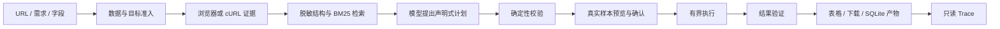

# Web Data Agent

**从网页证据到可核验数据的本地 AI 采集工作台。**

输入公开页面 URL、自然语言需求和字段，选择模型，检查真实样本后确认采集，最终查看表格并下载 JSON、CSV 或 Excel。

[安装与启动](INSTALL.md) · [使用指南](docs/WORKBENCH_V1.md) · [安全政策](SECURITY.md) · [中国法律合规指南](docs/COMPLIANCE_CN.md) · [贡献指南](CONTRIBUTING.md) · [MIT 许可证](LICENSE)

> 当前为开发版，适合本地学习、研究和受控验证；不是可直接部署的多用户采集服务。已验证一条真实公网与 DeepSeek 联合链路，不代表支持任意网站。法律与授权审查必须由使用者完成，程序放行不构成合法性判断。

## 能做什么

| 能力 | 当前实现 |
| --- | --- |
| 需求与字段 | description；字段说明、类型及必填约束；缺失可选值保留 null |
| 模型选择 | 默认配置或用户提供的兼容 Chat Completions HTTPS API；UI 密钥只存进程内存 |
| 预览确认 | 真实页面或接口样本，确认绑定计划指纹，复用已验证计划 |
| JSON 采集 | 观察到的同源 GET / 受限 JSON POST，页码分页 |
| 网页采集 | 声明式 CSS 提取、同源列表分页与详情链接、来源记录 |
| 结果交付 | 表格、JSON / CSV / XLSX；缺失、去重及完整性报告 |
| 可解释性 | BM25 案例检索、证据产物、只读 Trace；失败诊断不反馈到执行 |

最大 10 页、单任务单 worker；HTML 默认最多 100 条，显式条数最多 1000；任务总时限 180 秒。页数或条数截断可标记部分完成；总时限超时会失败，不保证保留部分结果。具体预算和 collector 兼容边界见[使用指南](docs/WORKBENCH_V1.md)。

不支持登录态、验证码、认证转发、跨源详情、任意 POST、cursor/offset 分页、多用户、分布式执行；京东/淘宝专项适配不在本版范围。POST 的 JSON 格式不能证明接口无副作用，操作者必须先确认其用途。

## 快速开始

已安装 Python 3.11、Node.js 24 与 Git 的 Windows / PowerShell 环境：

```powershell
git clone https://github.com/2510192670-heart/Evidence-Aware-Crawler-RAG-Agent.git
cd Evidence-Aware-Crawler-RAG-Agent
git switch fix/curl-live-verification
py -3.11 -m venv .venv
.venv/Scripts/python.exe -m pip install -r requirements.txt
.venv/Scripts/python.exe -m playwright install chromium
npm.cmd --prefix frontend ci
./scripts/start_workbench.ps1 -PolicyFile ./config/public-policy.example.json
```

打开[本地控制台](http://127.0.0.1:8002/console/)，在“配置自己的模型”中填写供应商信息，选择已配置网站后创建任务。保存配置不调用模型；测试连接和采集任务可能产生费用。

示例策略仅允许 books.toscrape.com。新增域名需先审查使用条件，再编辑部署策略并重启。不要将服务绑定公网或通过穿透、反向代理开放给不受信任用户。详细安装、升级、卸载和故障排查见 [INSTALL.md](INSTALL.md)。

## 工作原理

**LLM proposes. Deterministic code validates and executes.**



模型输出不会作为 Python、JavaScript 或 shell 执行。cURL 只解析成证据。既有修复最多应用一次，仅允许策略认可的 pointer_not_found；安全错误不自动修复。失败检索仅供诊断。检索评估不等于系统采集成功率提升。

## 数据与安全

- 采集目标使用部署侧允许名单、DNS/IP 分类、受控连接及 robots 检查；浏览器与执行器共用目标约束。
- 默认只监听本机。没有生产级账号、角色权限、租户隔离或加密存储承诺。
- 任务需求、结构摘要及案例提示会发送给所选模型供应商。不要输入个人信息、密钥、内部资料或商业秘密；关键词脱敏不能识别所有敏感信息。
- 结果、任务描述和来源会保存在本地。密钥内存保存不等于操作系统、浏览器、崩溃转储也绝不留痕。
- 网页公开、robots 允许、项目使用 MIT，均不能替代数据处理和再传播授权。

阅读[安全.md](安全.md)、[隐私与数据流](PRIVACY.md)和[合规指南](docs/COMPLIANCE_CN.md)，再对新的公网对象执行采集。

## 验证状态

截至 2026-09-16：

- 后端回归：**1040 passed / 1 failed**。失败为已存在的历史源码冻结断言，要求当前源码与 v0.5.4-freeze 完全一致；保留原断言，未跳过。
- TypeScript / Vite 构建通过；真实浏览器验证了预览、确认、表格及三种下载。
- 真实公网练习站 + DeepSeek：3 条记录，三种格式读回一致；2 次模型请求包含一次既有连接重试。
- 列表/详情与 HTTP 错误页拒绝在受控真实 HTTP 页面验证；尚未进行广泛网站兼容测试、第三方安全审计或法律合规认证。

完整证据见[验收记录](docs/WORKBENCH_V1_ACCEPTANCE.md)。目前未创建正式发布标签，不以绿色徽章隐藏失败。

## 仓库导航

| 路径 | 用途 |
| --- | --- |
| backend/app/pipeline/ | 观察、计划契约、执行、验证、导出 |
| backend/app/policy/ | 数据意图、目标、DNS/IP、robots 与运行边界 |
| backend/app/llm/ | 模型配置、网关及内存配置档 |
| backend/app/rag/ | BM25、特征门控和失败诊断检索 |
| backend/app/tasks/、storage/、trace/ | 任务、持久化和只读投影 |
| frontend/src/ | Vue 工作台与 Trace |
| tests/、benchmarks/、evaluation/ | 回归、冻结基准与检索评估 |
| docs/ | 使用、架构和历史里程碑证据 |
| demo/ | 独立的评估重叠检测演示，不是工作台启动入口 |

## 贡献、支持与许可

普通缺陷通过 [GitHub Issues](https://github.com/2510192670-heart/Evidence-Aware-Crawler-RAG-Agent/issues) 报告，不附真实凭证或采集数据。漏洞披露见 [SECURITY.md](SECURITY.md)；社区交流遵守[行为准则](CODE_OF_CONDUCT.md)。

原创代码及文档采用 [MIT](LICENSE)。第三方依赖、网页内容和商标不因本项目许可证而重新授权，见 [THIRD_PARTY_NOTICES.md](THIRD_PARTY_NOTICES.md)。本项目不提供政府批准、法律免责或网站授权证明。
