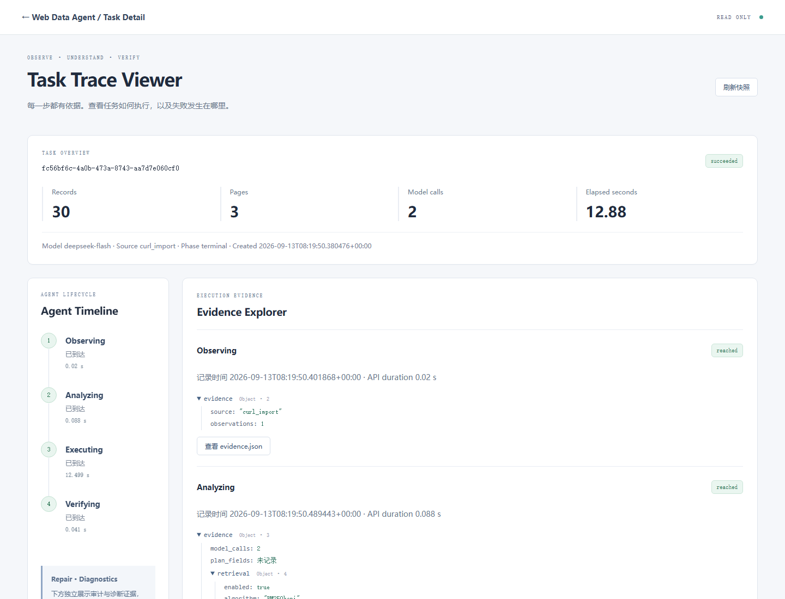
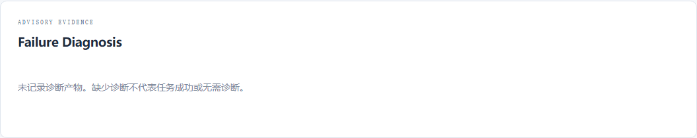
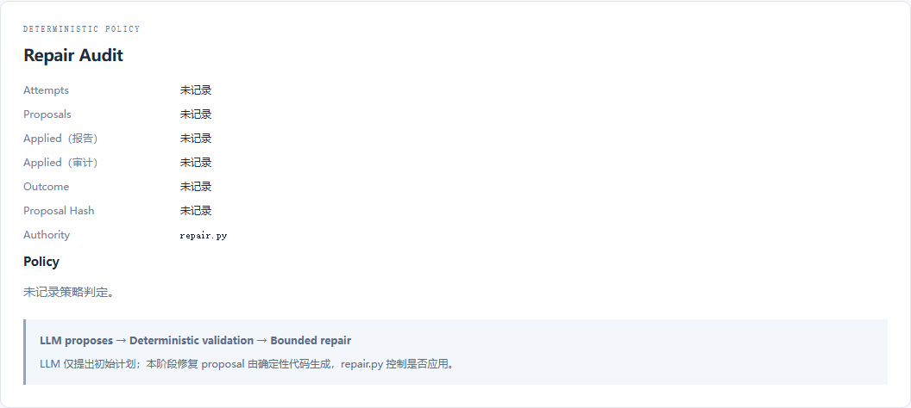

# Demo Story

目标：展示从观察证据到确定性执行验证，再到只读 Trace 的工程过程。下文区分真实任务展示、fixture 能力验证与通用操作脚本；实际运行记录单独列出。

## Real Task Demo

使用已有历史任务与原始 artifact，通过真实 GET API 展示。来源为 real task，不新增 Agent task、不调用模型、不修改数据库或 JSON。

- 成功任务 A：fc56bf6c-4a0b-473a-8743-aa7d7e060cf0。展示 Console、Timeline、Evidence、Retrieval 和结果，依据为已有持久化产物。
- 失败任务 B：33428c8d-77d0-4c53-9a27-91424ed25ea1。仅展示失败阶段与诊断/修复记录缺失，不能展示为已有诊断内容或修复裁决。
- 当前七张截图全部属于 Real Task Demo；05/06 不满足非空诊断/修复的真实验证，状态保留 NOT VERIFIED。

## Fixture Capability Demo

使用仓库现有 frontend/test_trace_viewer.py 中的 fixture，由原测试拦截浏览器 GET 响应，展示组件能够渲染的诊断字段、advisory only 提示、修复候选 hash 和策略理由等。2026-09-14 原测试运行结果为 14 passed，详见评估报告。

来源必须标为 fixture，不分配或冒用真实 task ID。fixture 中的 model_calls、案例、gate 和审计字段都是测试输入，不能解释成真实采集或修复发生过；某个 fixture 没有的 validation/applied/rejected 内容也不补造。本轮没有新增 fixture、修改测试或生成 fixture 截图。

| 区别 | Real Task Demo | Fixture Capability Demo |
| --- | --- | --- |
| 数据 | 既有数据库/任务 artifact | 原测试固定输入与拦截响应 |
| 证明范围 | 已有证据的实际读取展示 | 受控输入下的视图行为 |
| 诊断/修复结论 | 缺少真实 artifact，NOT VERIFIED | 已有组件测试通过，不替代真实验证 |
| 本次素材 | 七张真实截图 | 既有测试运行记录，无截图 |

## 准备

按 [README](../README.md#quick-start) 启动本地靶场与 Console。使用现有商品示例，字段 id/name/price_fen，max_pages=3。创建任务可能调用云模型；读取已有任务不产生模型调用。

分别标识成功任务 A、失败任务 B，必要时选择具有修复审计的任务 C。不得把它们拼成一次既成功又失败的任务。优先使用可核验的历史记录，不为获取失败截图反复请求模型，不修改任务产物。

## 通用展示流程（非本轮新建任务记录）

| 步骤 | 操作与展示 | 说明 |
| --- | --- | --- |
| 1 打开 Console | 查看本地目标、字段、页数与 RAG 开关 | literal loopback、单任务边界 |
| 2 创建任务 | 使用页面观察，或现有 cURL 解析预览后创建 | 导入是结构化证据，不执行 shell；两种来源不能混称 |
| 3 查看 Evidence | 打开 evidence.json | 展示实际请求与脱敏结构摘要 |
| 4 查看 Retrieval | 打开 retrieval.json | BM25、feature gate、案例 ID；inactive 如实保留 |
| 5 查看 Plan | 打开 plan.json | 初始计划引用真实请求；是否通过校验需结合报告 |
| 6 查看 Result | 核对 result.json、report.json 和 collector_verification.json（若存在） | 3 页 30 条是靶场预期，实际需核验；完整性、唯一性、导出比对分别检查 |
| 7 打开 Trace | Overview、四阶段 Timeline、Evidence 与 Artifact Explorer | 已有证据快照；刷新不执行任务 |
| 8 查看 Failure Diagnosis | 明确切换失败任务 B | 分类与 advisory 诊断；不返回规划，不影响修复 |
| 9 查看 Repair Audit | 查看 B 的记录，或明确切换任务 C | 展示真实策略理由、校验、拒绝或应用；没有记录保持未知 |

若当前没有符合条件的失败或修复样本，明确标记“暂无真实样本”。已有 UI fixture 可以说明渲染行为，但必须标为 UI fixture，不是实际 pipeline 任务。修复后成功的任务不保证有最终失败诊断产物。

## Screenshot Plan

已保存到 docs/screenshots/m5.4/；实际来源与缺失状态见下方验证记录。

| 编号 | 页面 | 目的 |
| --- | --- | --- |
| 01 | Console | 输入与历史入口 |
| 02 | 成功 Task Detail | 状态、结果和 Trace 入口 |
| 03 | Trace Overview + Timeline | 首页主图，展示只读与四阶段 |
| 04 | Evidence + Retrieval Insight | 证据与检索来源 |
| 05 | Failure Diagnosis | 失败分类和 advisory 边界 |
| 06 | Repair Audit | 策略与应用/拒绝记录 |
| 07 | Artifact Explorer | 原始 JSON 与文件元数据 |

建议统一 1440px 桌面视口，记录截图日期、代码提交、任务 ID（如适用）、来源类型（真实任务/UI fixture）。不修改 DOM 或补造值，不展示密钥或敏感请求信息。截图与原任务报告应一致。

## 展示结论

项目展示可核验的观察、规划、执行和诊断证据；不以截图证明系统成功率提升。当前 v1 knowledge inactive、field_mapping 未进入真实 retrieve、M6 未开始等限制保留，见 [评估报告](M5.4_EVALUATION_REPORT.md)。

## 2026-09-14 实际截图与读取记录

代码基线 fca594d，使用实际 8002 Console；没有修改页面 DOM、JSON 或图像状态。除 04 使用 1440×2300 视口后截取两区，其他使用 1440×1100 视口；局部图由浏览器直接截取元素。图片已逐张查看。

成功任务 A：fc56bf6c-4a0b-473a-8743-aa7d7e060cf0；失败任务 B：33428c8d-77d0-4c53-9a27-91424ed25ea1。全部来源为已有 real task，无 fixture 截图。

| 截图 | 来源与验收范围 |
| --- | --- |
| [01-console-home.png](screenshots/m5.4/01-console-home.png) | Console + 20 个历史任务；模型未配置，创建按钮实际禁用 |
| [02-task-detail.png](screenshots/m5.4/02-task-detail.png) | A，30 条/3 页与 Trace 入口 |
| [03-trace-overview.png](screenshots/m5.4/03-trace-overview.png) | A，Overview、Timeline、READ ONLY；首页主图候选 |
| [04-trace-evidence-retrieval.png](screenshots/m5.4/04-trace-evidence-retrieval.png) | A，Evidence 与 Retrieval；缺失投影字段保持未知 |
| [05-trace-failure.png](screenshots/m5.4/05-trace-failure.png) | B，**advisory only**；真实缺失诊断状态，非非空诊断实证 |
| [06-trace-repair.png](screenshots/m5.4/06-trace-repair.png) | B，真实缺失策略记录；没有 validation/applied/rejected 样本 |
| [07-artifact-json.png](screenshots/m5.4/07-artifact-json.png) | A，原始 retrieval.json 可打开检查 |

### Trace Overview

### Failure Diagnosis — advisory only

当前已有失败任务未记录诊断产物。此图只证明缺失状态如实展示，诊断不会触发规划或修复。

### Repair Audit — 缺少真实裁决样本

完整测试、hash 与只读验证见 [M5.4 Evaluation Report](M5.4_EVALUATION_REPORT.md)。当前全部 20 个任务都没有 failure_retrieval.json 或 repair.json；真实非空诊断/修复验证保留为 NOT VERIFIED；本次文档收口不补造案例。
