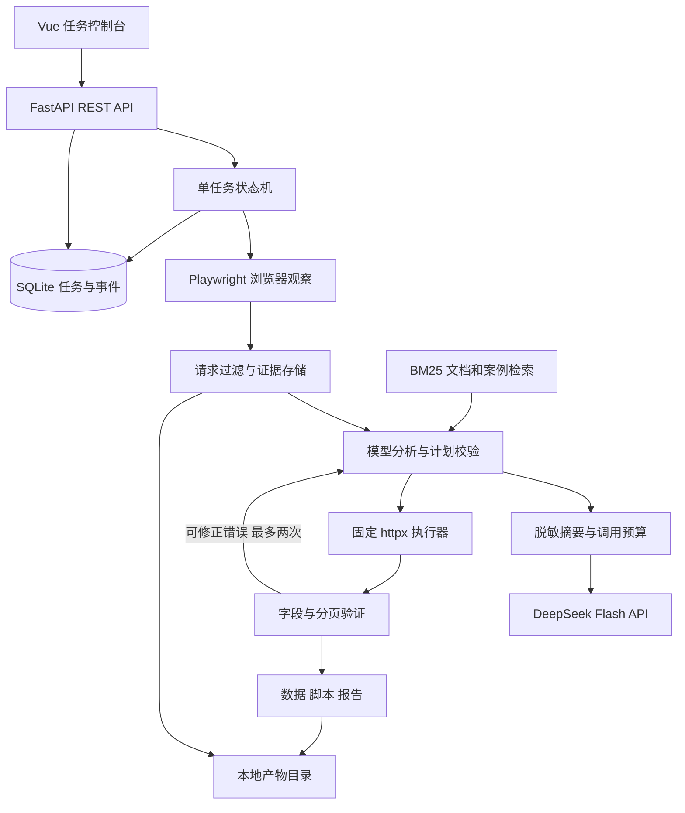

# Web Data Agent：初版设计与技术栈演进

日期：2026-09-12。适用目录：`E:\PaChongLLMragzuoping`。

状态：用户已选定“本地工具 + 云端模型 API”。本文件已按此路线修订；具体实现状态见 README，文中的目标架构不等于当前全部已完成。

## 1. 项目定位与约束

项目名称：Web Data Agent（网页数据接口分析助手）。

目标：用户提供允许分析的页面地址、目标字段和有限交互步骤，系统捕获真实请求，检索相关案例，由模型提出采集计划，再由确定性程序执行与验证，输出数据、脚本和证据报告。

开发条件：单人大三学生，Windows，i7-13620H，RTX 4060 Laptop 8GB 显存，约 16GB 内存。配置来自本任务此前的本机检查。规划按每周 8～12 小时估算，不包含额外硬件采购。

初版形态：本机、单用户、一次运行一个任务的模块化单体。模型通过配置的云端 API 调用；浏览器、数据处理、RAG、数据库和界面保留在本机。业务保持一个代码库，不拆微服务，初版不安装 Ollama、不下载生成模型。

项目价值集中在三个可证明的能力：

1. 每个接口结论都能追溯到捕获的请求与响应样本。
2. 模型给出的计划能通过程序校验，并完成有限范围的数据采集。
3. 可以比较规则、模型、RAG 对成功率、耗时与资源消耗的影响。

不以参数量或框架数量作为项目完成标准。

## 2. 当前代码与初版的关系

| 当前文件 | 已实现 | 初版中的处理方式 |
|---|---|---|
| `main.py` | FastAPI 商品分页接口，固定 30 条数据 | 保留为测试靶场，后续迁入 `fixtures/shop/` |
| `static/index.html` | 商品列表、前后翻页、错误重试 | 保留为靶场页面，不直接改成 Agent 控制台 |
| `collect.py` | 针对商品接口的采集与字段/分页校验 | 保留为人工编写的基线；提取通用逻辑时保留回归测试 |
| `tests/` | 原有 14 项接口与采集测试，另有新增网关测试 | 保留；新增证据、计划、任务、检索与集成测试 |
| `data/products.json` | 当前学习站的采集结果 | 作为样例产物，不作为所有任务共用输出文件 |
| `backend/app/llm/` | 云网关、Flash 配置、检查命令 | 组合业务 schema 后接入分析步骤；无自动脱敏或网页采集 |
| `requirements.txt` | 当前 Python 环境依赖快照 | 实现初版时整理直接依赖与锁文件；不要直接无界升级 |

当前已新增独立云网关与 DeepSeek Flash 预设，并完成离线测试。真实 DeepSeek API 联调及本机 GET 观察/分析/采集 CLI 已跑通（独立验证 30 条数据）；已新增任务 API、SQLite/SQLAlchemy/Alembic、进度、取消、历史与产物下载，并通过真实 API 核验；RAG、Vue 控制台、POST、自动修正和脚本导出尚未完成。

版本划分：当前是 v0.0 学习原型；本文件定义 v0.1 可展示初版；v0.2 增强检索和分析；v1.0 是有实际需求后才实施的服务化版本。

## 3. 方案选择

| 路线 | 优点 | 代价 | 结论 |
|---|---|---|---|
| 本地小模型 + 受限工作流 | 无强制 API 费用，能在个人电脑反复运行 | 模型判断能力有限，需要良好证据和校验 | 后续离线备选，不作为初版依赖 |
| 本地工具 + 云端模型 API | 可以比较更强模型，减少本机推理压力 | 费用、网络与数据上传边界 | 用户已选定的 v0.1 主路线；DeepSeek Flash，配置本机密钥后联调 |
| 本地 27B + 全套基础设施 | 有更多模型与服务实验空间 | 当前硬件资源紧张，运维和学习负担大 | 不作为初版路线 |

主后端保持 Python。没有将业务整体重写为 Java/Spring Boot 的计划：浏览器、模型、数据处理链路已经使用 Python。未来若出现组织现成的 Java 用户/权限平台，可通过 HTTP 接入它，保留 Python 分析服务，而不是重写分析逻辑。

## 4. v0.1 功能边界

### 必须完成

- 创建任务：填写页面 URL、目标描述、字段名称、最大页数；可配置最多 3 个预定义浏览器交互步骤。
- 浏览器观察：新建隔离浏览器上下文，先注册请求监听，再打开页面，执行显式配置的点击，记录 JSON 请求与响应。
- 接口分析：规则过滤明显噪声，模型从真实候选 request_id 中选择接口、映射字段、推断分页参数，并引用证据。
- 案例检索：检索精选文档与已验证案例，返回来源和版本，作为模型上下文。
- 计划执行：GET 查询参数或 POST JSON 请求体中的页码分页；单页 JSON 列表也支持。
- 结果校验：字段存在与类型、去重键、停止条件、条数与总数（如果接口提供）检查。
- 脚本导出：用经过审查的固定 Python 模板嵌入已验证计划，不自动执行任意模型源码。
- 产物展示：任务进度、请求证据、选中的接口与理由、数据预览、验证结果，下载 JSON、Python 脚本、Markdown 报告。
- 失败和取消：有限修正、错误分类、任务取消；浏览器和 HTTP 客户端最终释放。

### 明确不包含

- 任意网站自动适配、登录流程、验证码、访问控制绕过。
- 通用 JS 反混淆、完整调用图、自动还原签名算法。
- GraphQL 分析、WebSocket 数据采集、游标分页（v0.2 扩展）。
- 自由桌面操作、浏览器截图理解和无限制工具调用。
- 任意代码沙箱执行、多 Agent、微调、代理池、分布式抓取。
- 公网开放服务、多用户权限、计费、移动端 App。

外部页面可以作为兼容性试验，但 v0.1 成功率指标只针对明确支持的测试场景，不能外推到所有网站。

## 5. 确定的初版技术栈

| 层 | v0.1 选择 | 选择原因与约束 |
|---|---|---|
| 语言/环境 | Python 3.11 + `.venv` + pip | 复用已验证环境；先不增加新的包管理学习成本 |
| Web API | FastAPI + Uvicorn | 复用现有框架；只启动一个 API worker |
| 数据模型 | Pydantic 2 | API、模型输出与采集计划使用同一套 schema |
| 浏览器工具 | Playwright Python + Chromium | 监听请求、定位页面交互；优先使用官方高层 API，不先封装 CDP |
| 请求执行 | httpx | 支持 GET/POST、超时与连接复用 |
| 编排 | Python 显式状态机 + 一个受控后台任务 | 状态少且顺序明确；不引入 LangChain/LangGraph |
| 模型服务 | DeepSeek 官方 API | 用户已选定；本机不运行生成模型，不在无密钥时触发付费调用 |
| 模型基线 | `deepseek-flash` | 根地址 `https://api.deepseek.com`；JSON object、thinking disabled、max_tokens=1000；记录运行日期和模型别名 |
| 模型协议 | 内部 `ModelGateway`；首个适配器支持 Chat Completions 兼容协议 | 通过 httpx 调用；JSON object / JSON Schema 按能力显式配置，Pydantic 本地验证 |
| 检索 | rank-bm25 + 自有统一分词/归一化函数 | CPU 检索精选案例，初版无 Embedding/Reranker 常驻模型 |
| 持久化 | SQLite + SQLAlchemy 2 + Alembic | SQLite 存结构化任务；ORM 和迁移脚本降低后续数据库迁移成本 |
| 产物存储 | 本地文件 + 数据库元信息 | 响应样本、数据与脚本不直接堆在任务行中 |
| 前端 | Vue 3 + TypeScript + Vite + Vue Router | 构建任务列表/详情界面；保持一个前端框架，不同时引入 React |
| UI 组件 | 原生 HTML/CSS 与少量自有 Vue 组件 | 初版页面少，不引入大型组件库；暂不使用 Pinia |
| 前后端通信 | REST JSON + 1 秒轮询事件 | 初版单用户足够；后续需要时再迁移 SSE |
| 测试 | pytest + httpx MockTransport/TestClient + Playwright | 单元、接口、真实浏览器与固定任务评测分层验证 |
| 日志 | Python logging，JSON 格式事件 | 记录步骤、耗时、错误、模型制品与提示词版本 |
| 部署 | Windows 本机进程 | 开发期 Vite 代理 `/api`；展示时 FastAPI 托管前端构建产物 |

版本规则：现有环境快照继续保留；新增依赖在各里程碑验证后锁定。Vue/Vite 初始化时检查 Node engines 并选择满足要求的 Node LTS，记录实际版本及 npm lockfile；不在设计中编造未验证的小版本号。

模型名称、HTTPS base URL、API Key 从后端环境变量读取；密钥不进入前端或任务日志。兼容协议不等于所有模型参数通用，供应商能力需实测。JSON 模式只能保证格式的一部分，仍须处理空内容、截断和语义错误。[S11]

## 6. 运行架构与数据流



当前任务 API 使用 8002，已有靶场仍使用 8000（详见 TASK_API.md）。以下是前端集成后统一迁移的目标端口，不代表当前启动参数：迁移完成后，Agent 控制台/API 为 `127.0.0.1:8000`，学习靶场为 `127.0.0.1:8001`，模型服务使用配置的远程 HTTPS 地址，Vite 开发端口为 `5173`。当前原型仍占用 8000，真正迁移时要同时更新启动说明、采集默认地址和回归测试。

API 和任务控制器同一进程，使用 `asyncio` 管理长任务，Playwright/httpx 使用异步接口。SQLite 写入是短事务，不能在等待模型或网络时持有事务；同步数据库操作放到线程中执行，避免阻塞 API 事件循环。

初版仅允许一个非终态任务；忙时创建任务返回 409，不静默排队。此限制由单 worker 和服务内锁共同维护，不能开启多个 Uvicorn workers 绕过它。

## 7. 核心模块与稳定接口

业务代码依赖下列接口，而不是直接依赖模型、数据库或向量库的实现。

| 接口 | 输入 | 输出 | 未来可替换内容 |
|---|---|---|---|
| BrowserObserver.capture | TargetSpec、交互步骤、预算 | ObservationBundle | CDP 增强或远程浏览器 |
| ModelGateway.analyze | 任务、证据摘要、检索结果、schema、预算 | AnalysisDecision | 云端兼容 API、专有协议、本地 Ollama/vLLM |
| Retriever.search | 查询、标签、语料版本、top_k | 带来源的 RetrievedChunk 列表 | BM25、向量、混合检索 |
| PlanExecutor.execute | 已验证 ExtractionPlan、任务范围 | 批次结果与执行事件 | 新的分页策略和受限执行后端 |
| TaskRepository | 任务和事件的增删查改 | 业务模型 | SQLite → PostgreSQL |
| ArtifactStore | 字节流、类型、task_id | artifact_id、摘要与大小 | 本地文件 → 对象存储 |

所有主要对象带 `schema_version`。UUID 作为外部 ID；前端不依赖 SQLite 自增 ID、磁盘路径或模型供应商响应格式。

### 观察证据

每条请求至少包含：`request_id`、URL、method、resource_type、触发步骤、查询参数/JSON 请求体、status、content_type、响应字段形状、少量样本、正文是否截断、正文产物引用。

监听必须在页面导航前注册；首次导航后执行最多 3 个用户配置的点击。每步有独立超时，并在有限观察窗口内收集请求；不依赖永远不会结束的全局 network idle。

优先捕获 fetch/xhr 且返回 JSON 的请求，不只凭 URL 包含 `/api` 判断。HTTP 错误请求保留摘要用于诊断。先按方法、路径和请求形状去重，再保留分页变化样本。单响应落盘上限 256 KiB，每任务证据正文上限 10 MiB；超限标记截断并保留形状，不能把截断文本当完整 JSON 解析。

### 模型决策

AnalysisDecision 是联合类型：`plan`（给出计划）或 `insufficient_evidence`（说明缺少的证据）。后者允许受控补观察一次；仍不足时明确失败，不伪造接口。

ExtractionPlan 示例（设计样例，不是已实现 API）：

```json
{
  "schema_version": 1,
  "request_id": "req_012",
  "items_pointer": "/items",
  "fields": {"id": "/id", "name": "/name", "price_fen": "/price_fen"},
  "unique_key": "id",
  "pagination": {
    "kind": "page_number",
    "location": "query",
    "parameter": "page",
    "start": 1,
    "step": 1,
    "has_next_pointer": "/has_next",
    "total_pointer": "/total"
  },
  "evidence_ids": ["req_012", "req_018"]
}
```

字段路径统一采用 JSON Pointer；支持对象键和数组索引，不支持执行表达式。初版字段为扁平标量。method、目标 URL、基础 payload 从捕获的 request_id 解析，不接受模型凭空写入目标地址。

执行前校验：request_id 存在且属于本任务、方法属于 GET/POST、字段路径可在样本解析、分页修改位置合法、目标在任务白名单内、预算未超限。模型只允许修改已观察请求中的分页字段或有证据支持的字段路径。

只有用户/靶场声明为只读查询的 POST 接口可以重放，不能把所有 POST 自动视为查询操作。

### 采集与成功判定

- 硬性限制由控制器注入，模型不能提高页数、请求量或时间预算。
- 有 total 时比较累计唯一记录数；无 total 时仅能报告“已按停止条件采集”，不能声称已证明全站完整。
- `has_next=false` 或明确配置的空页停止；空页但 has_next=true、重复页、总数变化均报错。
- 页数达到用户上限时产物标记 `partial`；报告完成了用户指定范围，不标记全量完整。
- 业务字段失败、状态 200 错误页、JSON 不合法、字段路径失效都不能判成功。
- 自动重试仅限短暂网络故障，最多一次；401/403 不自动尝试绕过。模型修正最多两轮，并记录每轮差异。
- 同一套已验证计划驱动执行器和固定脚本模板。发布验收必须实际执行导出的脚本并比较结果，避免“界面可用、脚本不可用”。

## 8. 任务生命周期与 API

状态流：

`created → observing → analyzing → executing → verifying → succeeded`

任一步可到 `failed` 或 `cancelled`；可修正的验证失败回到 analyzing；进程重启时非终态任务标记 `interrupted`。初版只支持新任务重跑，不承诺从断点自动恢复。

取消策略：持久化取消标记，取消活动异步任务，关闭浏览器上下文/客户端；取消后不得再次提交成功结果。写产物使用临时文件后原子替换，数据库只登记已完成文件。进程退出若来不及清理，重启时清理已确认属于本应用的临时产物，不操作其他目录。

| API | 作用 |
|---|---|
| POST `/api/v1/tasks` | 创建任务；返回 202 与 task_id；忙时 409 |
| GET `/api/v1/tasks` | 分页任务列表 |
| GET `/api/v1/tasks/{id}` | 当前状态、摘要、配置快照 |
| GET `/api/v1/tasks/{id}/events?after_seq=N` | 增量事件；无新事件返回空数组 |
| POST `/api/v1/tasks/{id}/cancel` | 幂等取消，返回实际当前状态 |
| GET `/api/v1/tasks/{id}/evidence` | 请求摘要与候选接口 |
| GET `/api/v1/tasks/{id}/artifacts` | 文件清单、类型、验证状态 |
| GET `/api/v1/artifacts/{id}/download` | 根据数据库映射下载，不接收任意磁盘路径 |
| GET `/api/v1/health` | API、数据库、模型可达性与能力检查摘要 |

统一错误格式：`code`、`message`、`task_id`（如适用）、`retryable`；内部异常栈仅进本机日志。

事件包含 `task_id`、递增 `seq`、时间、阶段、事件类型和短摘要。前端用 seq 去重，任务结束即停止轮询；重连从最后 seq 继续。

前端页面：任务列表、新建任务、任务详情。详情分为进度、接口证据、数据预览与产物；显示当前模型、检索是否启用以及结果完整性，避免用户误解演示范围。

当前实现增加 cancelling 过渡态，取消接口等待清理；同目录进程锁阻止多个 API 实例误做恢复。当前持久化三张业务表 tasks/task_events/artifacts，其余表在后续对应功能实施时新增。

## 9. 数据存储与检索

### SQLite 表

| 表 | 关键字段 |
|---|---|
| tasks | id、schema_version、status、target、goal、limits、model/config/prompt/corpus 版本快照、时间、error_code |
| task_events | task_id、seq（联合唯一）、stage、type、payload、created_at |
| requests | id、task_id、method、脱敏 URL、summary、body_artifact_id、truncated |
| plans | id、task_id、attempt、validated_plan、evidence_ids、validation_result |
| artifacts | id、task_id、kind、相对路径、sha256、字节数、完整性标签 |
| cases | id、source、version、tags、content_hash、verified_at、enabled、split |

任务、事件和产物外键明确；日期统一 UTC，界面再转换。启用外键约束，使用短事务；SQLite 写锁和迁移行为要有测试。SQLAlchemy 可降低迁移成本，但不保证 SQLite 与 PostgreSQL 的事务和类型行为完全相同。[S6]

产物目录：`data/tasks/{task_id}/`，包含 `evidence/`、`plan.json`、`result.json`、`collector.py`、`report.md`。任务之间不覆盖。模型日志和输出限制大小；导出的报告不包含 API key、Cookie 或 Authorization 值。

### v0.1 的 RAG

RAG 使用文档/案例检索增强生成，不要求必须是向量数据库。

准备 20～30 条精选知识：分页模式、httpx/Playwright 基本用法、错误案例。按主题切块并记录来源 URL、时间、内容 hash。使用 rank-bm25 的 BM25Okapi；它需要自行预处理输入。[S8]

分词固定版本：英文小写词、保留接口路径/参数名并拆分标识符、中文字符二元组。文档和查询使用同一函数，不直接对中文按空格切分。先用中文/英文参数混合查询集验证检索质量，再考虑引入分词库。

检索输入为用户目标 + 规则提取的接口/分页特征；首版不增加模型查询改写。Top 3 入上下文，总量控制在约 800 tokens；记录命中文档 ID。没有有效命中就不拼接无关材料。

成功轨迹可作为候选案例保存，但只有验证通过且确认无凭证的案例才进入启用语料；测试留出集不自动回流。案例是线索，目标接口必须重新观察验证。

## 10. 资源与运行边界

以下是初始配置/验收预算，不是本机已实测指标：

| 项目 | 初始上限 |
|---|---|
| 并发任务 | 1 |
| 浏览器 | 每任务一个 context、一个页面 |
| 交互步骤 | 最多 3 次显式点击 |
| 单次导航 | 20 秒 |
| 单次 HTTP 请求 | 10 秒 |
| 每任务实际发出的采集请求 | 最多 50 次，包含重试和验证请求 |
| 默认采集页数 | 3，用户最多设置 10 |
| 模型调用 | 总计最多 4 次，包括补观察后的分析和修正 |
| 单次模型超时 | 120 秒 |
| 任务总超时 | 600 秒；超时优先于其他预算 |
| 模型请求预算 | 输入目标约 3000 tokens，输出最多 1000；精确分词器未知时标为估算，供应商 usage 为实际统计 |
| 证据摘要 | 最多 5 个候选，每个只展示字段形状与极少样本 |
| 自动修正 | 最多 2 次，不覆盖总模型调用上限 |
| 本机资源目标 | 全机 RAM 尽量低于 12 GiB；初版无需生成模型显存，浏览器仍有自身占用；实测后调整 |

实现状态（2026-09-13）：上表为设计目标，尚未全部落地。当前实现**未实现 600 秒 total-task timeout**，而是采用 180 秒 core pipeline budget（`asyncio.timeout(180)` 仅约束核心采集流程）；成功后的 collector 导出为 best-effort 后处理，子进程另有 30 秒上限，故整个任务 wall-clock 可能超过 180 秒。

原始响应留在文件中，云端只接收用户目标、字段形状、脱敏短样本与检索片段。输入设字节硬上限并标注 token 估算；供应商 usage 缺失标 unknown，不能记为零。超预算先压缩样本和候选数，不静默截断系统指令或 JSON schema。

云端路线优先控制请求量和费用。最多 4 次模型调用包含所有实际发送的请求；超时可能已计费，模型网关仅对 connect_timeout / network_error 这类短暂连接故障重试一次并计入预算。401/403 配置错误、429 限流、5xx 服务错误均分类报告。用户取消只保证本地停止等待，不能承诺供应商停止生成或退款。

服务默认只监听 loopback。靶场模式允许显式列出的本机 origin（如 8001）；外部模式检查协议、域名、解析 IP、端口和重定向，拒绝未列入范围的内网/回环地址，不能仅检查初始 URL。浏览器与 HTTP 执行器使用一致的目标范围。

不将网页文本或检索片段当成系统指令。工具调用白名单、路径访问和预算由程序强制执行。云模型是已选主路线；未配置凭证时只允许离线测试，不伪装成功。只发送任务所需的脱敏摘要，完整 HAR、Cookie、Authorization、API Key、本地文件和未筛选响应不上传。

### 云费用与凭证补充

- 密钥仅在后端环境/进程内存，连通性检查支持隐藏输入，不写磁盘。
- 默认 DeepSeek 预设，JSON object，本地 schema 校验；不假定供应商支持通用 strict JSON Schema。
- 每任务最多 4 次请求，包含超时/取消/失败；网关仅对 connect_timeout / network_error 重试一次并计入预算，无其他自动重试。未来每日请求限制由任务数据库记录，不把单实例预算冒充账号总限额。
- 记录输入、输出和缓存命中/未命中 token；缺失为 unknown。缓存分类不能与总输入重复相加。
- 官方价格页本次读取失败，金额单价尚未核验，当前不提供金额估算。真实账单为准；后续价格配置必须有币种、日期和来源，未知费用不能记 0。
- 首次真实联调只发送固定连通性内容，不上传网页数据。当前观察模块只对本机测试站生成类型摘要，不宣称任意网站通用脱敏。详细范围见 RUN_LOCAL_AGENT.md。

## 11. 建议目录（待后续实施，不代表已存在）

```text
backend/
  app/
    main.py
    api/                 # HTTP 路由与错误映射
    schemas/             # task / evidence / plan / result
    workflow/            # 状态机、预算、取消
    browser/             # 观察、交互、请求过滤
    llm/                 # ModelGateway 与云端 API 适配器
    retrieval/           # 分词、BM25、来源引用
    execution/           # 固定请求执行器、分页策略、脚本模板
    validation/          # 字段、去重、完整性
    storage/             # SQLAlchemy、repository、artifact store
    core/                # 配置、日志、目标范围
  migrations/            # Alembic
frontend/                # Vue 3 + TS + Vite
fixtures/shop/           # 当前学习站迁入此处
knowledge/               # 精选 Markdown/JSON 案例
benchmarks/              # 清单、split、标准答案与评测器
tests/                   # unit / integration / browser
data/tasks/              # 运行产物，不提交 Git
docs/                    # 设计、使用说明、评测结论
```

避免每个小函数都创建一个模块，也不提前编写暂时不用的 PostgreSQL/vLLM 适配器。接口边界先确定，第二个实现真正出现时再抽取必要的公共代码。

## 12. 分阶段交付与验收

总计约 8～12 周，按学习进度调整；当前学习原型不重复建设。

| 里程碑 | 内容 | 可核验产物 |
|---|---|---|
| M1：约 1～2 周 | 靶场和业务分离；Playwright 观察；证据 schema | 页面翻页能产出请求差异与响应样本；API 监听顺序正确 |
| M2：约 1～2 周 | 云端 API 接入、结构化计划、固定执行器 | 基础 GET 场景走通；无证据 request_id 被拒绝；模型不可用明确失败 |
| M3：约 1～2 周 | 状态机、SQLite、预算、取消、脚本导出 | 任务重启标 interrupted；取消释放资源；脚本运行与结果一致 |
| M4：约 1～2 周 | BM25 案例 RAG、POST JSON 场景、受限修正 | 有来源的检索；可比较无 RAG/有 RAG；错误数据不会误判成功 |
| M5：约 1～2 周 | Vue 控制台、产物下载、端到端流程 | 创建到下载全部可操作；刷新不丢任务状态；桌面和窄屏通过 |
| M6：约 1～2 周 | 留出评测、文档、录屏、固定依赖 | 可复现实验、失败案例、资源报告、安装启动说明 |

基准集：5 类场景 × 4 个变体，共 20 个任务：GET 页码分页、POST JSON 页码分页、嵌套字段与短末页、多候选干扰接口、错误/字段漂移场景。按变体划分 10 个开发任务和 10 个留出任务；知识案例单独制作。错误场景标准答案可以是“明确失败”，不要求强行采集成功。

防止过拟合：变化路由名称、字段名、请求方法、分页键和干扰接口；执行器不能硬编码商品接口。标准答案由独立测试数据定义，不能把待评估的同一段逻辑当唯一验证器。

三组对照：A 规则基线、B 规则+模型、C 规则+模型+案例 RAG。固定供应商/模型版本、提示词、语料、预算和任务集；留出集最终运行三次，分别记录结果。10 个留出任务是小样本，不把差异表述成统计显著。

验收目标（未达到前不得写成成果）：

- 在每轮 10 个留出任务中至少 8 个达到对应成功/正确拒绝标准；同时分开报告可采集任务成功率和异常任务正确识别率。
- 正常确定性任务输出数据与标准答案逐条匹配；ID 无重复，字段和金额正确。
- 伪造 request_id、超范围 URL、非法字段路径、无限分页都被阻止。
- 取消与进程重启语义符合第 8 节；重复取消不产生状态回退。
- 导出的脚本在隔离测试环境实际运行并与结果文件一致。
- UI 创建、进度、失败、取消、下载完成端到端验证，正常路径无应用控制台错误。
- 报告记录任务成功率、接口选择正确率、检索命中、模型调用次数、token、p50/p95 耗时、峰值 RAM/VRAM；硬件指标实测，不从模型大小推断。

若 RAG 不提升结果，保留实验结论和可关闭开关，不为展示而编造增益。若选定云模型未达标，保留 v0.1 候选状态，先分析观察/规则/模型/执行器各类失败比例。

## 13. 技术栈演进总表

迁移条件是本项目的决策阈值，不是相关技术的普遍容量上限。没有出现对应需求时继续使用旧方案。

| 模块 | v0.1 | 后续目标 | 触发条件 | 迁移方法与回退 |
|---|---|---|---|---|
| 模型 | 云端文本模型 API | 比较其他云模型；有离线需求后评估本地模型 | 失败归因证明主要受模型能力限制，且固定失败集对照有收益 | 新增 ModelGateway 适配器/模型配置；校验输出、超时、token 统计；保留原模型配置 |
| 推理服务 | 托管云 API | 可选本地 Ollama / Linux GPU vLLM | 离线/数据驻留要求或经测算自托管更合适，且具备硬件 | 保留网关；比较兼容性、运维与总成本；切回原云配置即回退 |
| 编排 | Python 状态机 | LangGraph + 持久化 checkpointer | 真正需要步骤恢复、人工暂停、复杂分支；不能只因框架流行 | 现有阶段包装为节点；新任务使用新 workflow_version，旧任务仍由旧版本读取 |
| 数据库 | SQLite | PostgreSQL | 出现多 worker/多用户写入、锁等待影响目标耗时，或需独立备份运维 | Alembic 建目标结构，停写快照，导入、核对 ID/计数/关联/时间，再切配置；切换期禁止双写 |
| 检索 | BM25 | BM25 + bge-small-zh-v1.5 + Qdrant + RRF | 同义表达造成稳定漏检，检索开发集验证向量有收益 | 先离线建索引，保持同一 chunk_id/source；比较 Recall@3 和任务成功率；可关闭向量分支 |
| 向量服务 | 无 | 先 Qdrant 本地模式，再独立 Qdrant 服务 | v0.2 引入向量；后续多个进程需共享索引时服务化 | 通过 Retriever 接口替换；原始语料和模型/分块版本可重建，不依赖直接复制内部目录 |
| 重排 | 无 | 小型 Reranker，BGE 系列候选 | 混合召回已找到答案但 Top 3 排序差，且耗时预算允许 | 只重排 Top 10，不与生成模型争用 GPU；测量收益，不达标关闭 |
| 任务执行 | 单进程、单任务 | Linux 独立 worker + Redis/Celery | 需要排队、多任务隔离或 API 重启不影响执行 | SQLite 先迁 PostgreSQL；数据库为任务事实源，队列只传 task_id；加幂等和租约防重复 |
| 进度通信 | REST 轮询 | SSE | 多任务轮询开销明显或需连续事件流 | 复用事件 seq/Last-Event-ID，保留轮询回退；不默认上 WebSocket |
| 前端 | Vue 3 + TS | 原栈保留；按需加 Pinia、组件库 | 跨页面共享状态或界面复杂性已出现 | 保持 API 契约；不为升级重写 React |
| JS 分析 | 无 | Node.js + Babel parser/traverse | HTTP 观察不足，限定场景需要定位函数与参数来源 | 增加独立 JS 分析适配器，只处理受支持语法，返回源码位置；不替换既有 HTTP 流程 |
| 代码执行 | 固定执行器与模板 | 受限容器执行 Python/Node | 必须验证模板无法表达的生成代码 | Linux 容器限制用户/CPU/内存/时间/网络/挂载；禁挂 Docker socket；保留模板路径 |
| 部署 | Windows 本机 | Linux + Docker Compose | 需要在另一台机器稳定展示或团队共享 | 前后端先容器化；模型独立配置；持久化卷和迁移演练，不直接上 Kubernetes |
| 产物 | 本地目录 | S3 兼容对象存储 | 多 worker 需要共享下载产物 | ArtifactStore 改实现，保留 artifact_id/hash；先复制校验再切读 |
| 微调 | 无 | 后期 LoRA/QLoRA 实验 | 有足量清洗且可授权的轨迹，工具/RAG 改进后仍有可学习的系统性错误 | 单独云 GPU 实验；模型/适配器/量化格式兼容验证；独立留出集对照，未提升不部署 |

vLLM 的目标环境定为 Linux，不把当前 Windows 机器直接替换成 vLLM 部署机；安装和量化支持以选定模型及实际运行版本文档为准。[S7]

LangGraph 的 checkpointer 用于任务状态恢复，store 用于跨任务资料；这两者与业务任务表不是同一个概念，需要定义各自事实来源。[S5]

Qdrant 支持本地使用路径，后期部署服务时另行配置访问控制与备份。更换 Embedding 模型意味着重建向量索引；不同模型或维度的向量不能直接混用。[S9][S10]

## 14. 实际迁移顺序

### 路线 A：继续在个人电脑深化（优先）

1. 完成 v0.1 并保留评测基线。
2. v0.2 先增加游标分页策略和更丰富的靶场，再做轻量向量检索对照。
3. 只在任务恢复需求出现时迁移 LangGraph；只在模型瓶颈或费用压力明确时比较其他云模型；离线需求出现后再评估本地模型。
4. SQLite、Windows、Vue、FastAPI 均可继续保留；不要求服务化。

### 路线 B：发展成共享服务（有需求后）

1. 明确用户身份、任务归属、凭证管理和外部目标策略；本机无认证方案不能直接暴露公网。
2. 把业务和浏览器执行迁到 Linux，完成依赖、文件路径、浏览器安装回归。
3. SQLite 停写迁 PostgreSQL；产物按需迁对象存储。
4. 引入 Redis/Celery worker；HTTP 重试和队列重投必须幂等，任务阶段用版本与租约控制。
5. 根据检索与推理需求分别评估独立 Qdrant、云 API 配额或自托管 vLLM；可以长期保留云 API，不用一次全部替换。
6. 压测后才增加并发；浏览器并发与模型并发分别配置，不以 API worker 数代替容量规划。

每次迁移流程固定为：保存旧配置/备份 → 新实现并行读或离线验证 → 同一测试集对照 → 切换新任务 → 观察 → 保留可回退路径。数据库切换后若已有新写入，回退必须先同步这些变更，不能直接用旧快照覆盖新数据。

## 15. 初版交付清单

- 可启动的 Agent API、Vue 控制台、独立测试靶场。
- 可替换模型网关，以及一个实际通过评测的云端模型配置。
- 网络证据、受校验计划、确定性执行、验证与报告闭环。
- BM25 案例检索，来源和语料版本可追溯。
- 单任务生命周期、预算、取消、重启处理。
- 独立任务产物目录、可运行采集脚本、数据下载。
- 开发/留出任务清单、三组对照结果和资源测量。
- Windows 安装启动文档、已知限制、演示视频。

技术栈已经确定；是否进入后续技术迁移取决于第 13 节条件，而不是完成初版后自动把所有组件换一遍。

## 16. 官方资料与核验范围

本次核验的是官方能力说明，不代表新增组件已经在本机安装或通过兼容测试。以下资料用于选型，架构与阈值属于本项目设计决定。

- [S1 Qwen3-4B 模型卡](https://huggingface.co/Qwen/Qwen3-4B)：模型规模与部署入口。
- [S2 Ollama structured outputs](https://docs.ollama.com/capabilities/structured-outputs)：JSON Schema 输出和 Pydantic 验证；仅供未来本地备选路线参考。
- [S3 Playwright network](https://playwright.dev/python/docs/network)：请求/响应监听。
- [S4 Vue quick start](https://vuejs.org/guide/quick-start.html)：Vue/Vite/TypeScript 初始化路线与环境要求。
- [S5 LangGraph persistence](https://docs.langchain.com/oss/python/langgraph/persistence)：checkpointer 与 store。
- [S6 SQLAlchemy SQLite](https://docs.sqlalchemy.org/en/20/dialects/sqlite.html)：SQLite 方言与事务差异。
- [S7 vLLM GPU installation](https://docs.vllm.ai/en/latest/getting_started/installation/gpu/)：平台和 GPU 安装约束。
- [S8 rank_bm25 项目](https://github.com/dorianbrown/rank_bm25)：BM25 与输入预处理。
- [S9 Qdrant quickstart](https://qdrant.tech/documentation/quickstart/)：本地与服务使用路径。
- [S10 bge-small-zh-v1.5](https://huggingface.co/BAAI/bge-small-zh-v1.5)：下一阶段轻量中文向量模型候选。

- [S11 DeepSeek JSON mode](https://api-docs.deepseek.com/guides/json_mode/)：已选 DeepSeek 的 JSON 模式与空内容处理。
- [S12 HTTPX timeouts](https://www.python-httpx.org/advanced/timeouts/)：连接/读写超时与总耗时预算需要分别处理。

- [S13 DeepSeek API quickstart](https://api-docs.deepseek.com/)：核对 deepseek-flash 与根地址。
- [S14 DeepSeek thinking mode](https://api-docs.deepseek.com/guides/thinking_mode/)：初版显式禁用 thinking；后续按评测开启。
